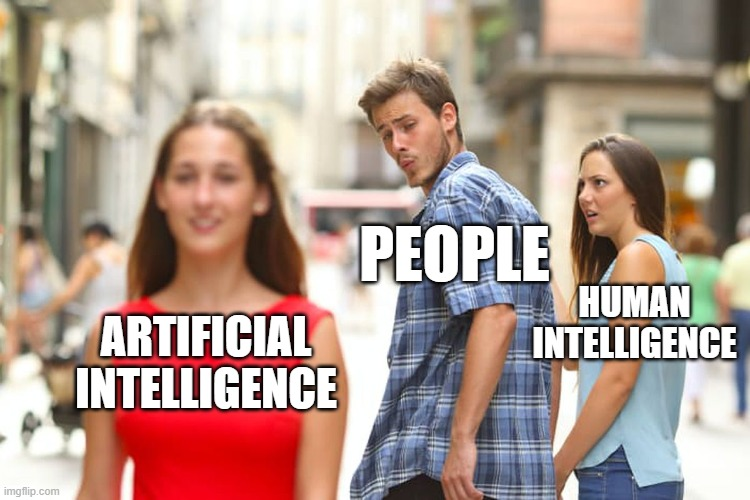

  

## I. Introduction

Artificial Intelligence has become almost impossible to avoid in education, especially in computer science and software engineering. Whether it is helping students debug code, explain 
concepts, generate examples, or organize ideas, AI tools are changing how people learn and solve problems. In ICS 314, AI became less of a futuristic concept and more of an everyday tool 
sitting in another browser tab beside VS Code, Discord, GitHub, and lecture notes. Sometimes it felt like having a tutor available at 2:00 AM. Other times it felt like confidently asking 
a stranger for directions only to realize halfway through following them that they had absolutely no idea where they were going.

The main AI tools I used throughout ICS 314 were ChatGPT and GitHub Copilot. I occasionally experimented with other AI systems such as Gemini, but ChatGPT became my primary tool because 
of how conversational and flexible it was when asking programming questions. My mindset toward AI throughout this course was that it should function like a calculator in math. A 
calculator helps speed up calculations, but it does not replace understanding the math itself. In the same way, I do not think AI should replace a student’s ability to think critically, 
write code independently, or understand why something works. The real skill is being able to evaluate whether the AI output actually makes sense, whether it fits the project requirements, 
and whether it is quietly creating a future debugging nightmare.

Over the semester, AI influenced almost every aspect of my workflow in ICS 314. It helped me learn unfamiliar concepts, generate starting points for assignments, debug strange errors, 
improve essays, brainstorm project ideas, and even calm my stress during timed WODs. However, it also taught me that blindly trusting generated answers can create more problems than 
solutions. Learning how to work with AI effectively became its own software engineering skill.

## II. Personal Experience with AI
Experience WODs

AI was extremely useful during Experience WODs because they often introduced unfamiliar concepts or required multiple technologies working together. For example, during database and 
Prisma-related WODs, I would ask questions like:

“Why is my Prisma migration failing with this error?”
“Explain what this schema does.”
“Help me understand why this Next.js page is crashing.”

AI was most helpful for debugging and explaining confusing error messages in real time. Instead of immediately panicking and spamming my professor or Discord with questions, I could first 
ask AI to explain what the error meant in simpler terms. Sometimes the explanation instantly solved the issue. Other times AI confidently gave me the wrong solution three times in a row 
while I slowly lost faith in both the AI and myself.

The benefit was speed and accessibility. The downside was that AI sometimes generated answers that looked correct but did not actually fit the assignment requirements.

In-Class Practice WODs

For practice WODs, AI mainly acted like a confidence checker. Under time pressure, there is this strange feeling where you stare at your code wondering if you are secretly about to fail 
because of one missing semicolon or incorrect import. AI sometimes became that green check mark many of us unintentionally look for to reassure ourselves that we are not completely off 
track.

For example, I would ask:

“Does this function correctly use map and filter?”
“Is this React component structured correctly?”

AI helped reduce anxiety during practice, but I also realized that relying on reassurance too much could become dangerous because it can prevent independent thinking.

In Class WODs

During actual WODs, I used AI much more carefully because the time pressure was intense. Sometimes it genuinely felt like AI was the hand rubbing your back while a countdown timer quietly 
threatened your GPA in the corner of the screen. (or the ESLint errors)

I mainly used it for syntax reminders, debugging, or clarifying small issues. For example:

“What is the correct syntax for destructuring props in React?”
“Why is this import undefined?”

However, I avoided asking AI to generate entire solutions because I knew that debugging broken AI-generated code during a timed WOD would probably waste more time than writing it myself. 
There is nothing more terrifying than pasting AI code into your project, running it confidently, and watching your terminal explode with twelve errors you have never seen before.

Essays

For essays, AI helped more with brainstorming and organization than actual writing. I used prompts such as:

“Help me organize this reflection essay.”
“Give me examples of how AI impacts software engineering education.”

I intentionally avoided having AI fully write essays for me because I wanted the final writing to sound like my own thoughts and experiences. AI-generated essays often sounded overly 
robotic or strangely formal, like a motivational LinkedIn post written by a machine pretending to be human.

Final Project

AI was probably most useful during the final project because our project involved Next.js, React, Prisma, Vercel deployment, authentication systems, UI design, and debugging multiple 
technologies interacting together.

I used prompts such as:

“Why is my Vercel deployment failing?”
“How do I connect Prisma to PostgreSQL?”
“Help me structure this React Bootstrap layout.”

AI was useful for generating initial ideas and debugging difficult issues, but almost every solution required manual editing. One of the biggest lessons I learned was that generated code 
rarely works perfectly inside an existing codebase without modification. Sometimes fixing AI-generated code took longer than writing the feature myself.

Learning a Concept or Tutorial

AI became extremely useful for learning concepts because it could explain technical topics conversationally. Instead of reading documentation filled with unfamiliar terminology, I could ask:

“Explain Prisma migrations like I am a beginner.”
“What is hydration mismatch in Next.js?”

This made difficult concepts feel more approachable and less intimidating.

Answering a Question in Class or Discord

Sometimes I used AI before asking questions publicly because I wanted to avoid asking something that had an obvious answer. AI helped me clarify my understanding before posting in Discord 
or speaking in class.

However, I learned that AI is not always correct, so I still needed human confirmation for important questions.

Asking or Answering a Smart Question

AI helped me formulate better technical questions. Instead of saying:

“My code does not work.”

I learned to ask more specific questions like:

“Why is my Prisma schema failing validation after adding this relationship?”

This improved both my communication skills and problem solving process.

Coding Example

For coding examples, AI was extremely helpful. I used prompts such as:

“Give an example of using underscore .pluck.”
“Show an example of React state management.”

These examples gave me starting points and helped me recognize coding patterns faster.

Explaining Code

One of AI’s strongest abilities was explaining code. I often pasted confusing code snippets and asked:

“Explain what this function is doing line by line.”

This was especially helpful when learning unfamiliar JavaScript syntax or React hooks.

Writing Code

AI helped generate starter code and boilerplate structures, especially for React components or database models. However, I learned very quickly that generated code should never be trusted 
blindly.

AI sometimes wrote code that looked beautifully correct while secretly creating future bugs hiding in dark corners of the project waiting to ruin my evening later.

Documenting Code

AI was surprisingly useful for writing comments and improving readability. It helped turn messy explanations into clearer documentation.

However, I still needed to review everything because AI occasionally documented code incorrectly or described functionality that the code did not actually perform.

Quality Assurance

AI was extremely useful for debugging and quality assurance. I frequently used prompts such as:

“What is wrong with this code?”
“Fix the ESLint errors in this file.”

Sometimes AI identifies mistakes immediately. Other times, it suggested solutions that introduced even more problems. Those moments usually involved me staring at my monitor in complete 
silence while wondering how a “simple fix” somehow destroyed five unrelated files.

Other Uses in ICS 314

Outside the categories above, AI also helped me brainstorm project ideas, improve UI wording, revise GitHub README files, organize thoughts for presentations, and simplify technical 
explanations.

## III. Impact on Learning and Understanding

AI significantly influenced my learning experience in ICS 314. In many ways, it accelerated my ability to learn unfamiliar technologies because I could ask questions conversationally 
instead of relying entirely on documentation. AI made difficult concepts feel more approachable and reduced the frustration of being completely stuck.

However, AI also challenged my understanding because it forced me to develop critical thinking skills. I learned very quickly that code compiling successfully does not automatically mean 
the solution is correct. Sometimes, AI-generated code technically worked while still being poorly designed or incompatible with the project requirements.

I think the biggest skill AI taught me was verification. The goal is not just generating answers but understanding whether the answer actually solves the problem correctly.

## IV. Practical Applications

Outside ICS 314, I have also used AI in projects involving Retrieval Augmented Generation systems, bioinformatics research, and software development internships. AI helped brainstorm 
approaches, summarize information, explain libraries, and debug implementation issues.

In real-world projects, AI was most effective as an assistant rather than a replacement for human understanding. It helped speed up research and prototyping, but careful verification was always necessary. + it's always fun to use to vibe code!

## V. Challenges and Opportunities

One challenge with AI is that it sometimes produces incorrect or outdated information very confidently. Beginners may struggle to recognize when AI is wrong, which can create dependency 
problems.

Another challenge is overreliance. If students constantly copy solutions without understanding them, they may weaken their own problem-solving skills.

At the same time, AI creates huge opportunities for software engineering education. It can provide instant explanations, personalized tutoring, debugging assistance, and interactive 
learning experiences that traditional classrooms sometimes cannot provide immediately.

## VI. Comparative Analysis

Traditional teaching methods and AI-enhanced learning both have strengths and weaknesses. Traditional methods encourage deeper patience, independent thinking, and long-term retention. AI-
enhanced approaches improve accessibility, speed, and immediate feedback.

In my experience, AI worked best when combined with traditional learning rather than replacing it. Reading documentation, attending lectures, and struggling through problems independently 
still mattered. AI simply made the learning process more interactive and less isolating.

## VII. Future Considerations

I think AI will become increasingly integrated into software engineering education in the future. Students will likely use AI the same way programmers currently use search engines, Stack Overflow, or documentation.

However, education will also need to adapt by focusing more on critical thinking, verification, debugging, and understanding rather than memorization alone. Knowing how to evaluate AI 
output may become just as important as writing code itself.

## VIII. Conclusion

Overall, AI had a major impact on my experience in ICS 314. It helped me debug code, learn concepts, brainstorm ideas, improve communication, and reduce frustration during difficult assignments and WODs. At the same time, it taught me the importance of verification, independent thinking, and understanding the reasoning behind generated solutions.

I believe AI works best as a tool rather than a replacement for learning. Just like a calculator helps with math without replacing mathematical understanding, AI can support software 
engineering education without replacing problem-solving skills. The most valuable part of using AI was not simply getting answers faster, but learning how to critically evaluate whether 
those answers were actually useful, correct, and maintainable.

By the end of the course, I realized that software engineering is not just about writing code. It is also about communication, reasoning, debugging, adaptation, and learning how to work 
alongside tools responsibly. AI became part of that process, sometimes acting like a tutor, sometimes acting like a second opinion, and occasionally acting like a chaos generator that 
accidentally created more bugs than it solved. Even so, learning how to navigate those strengths and weaknesses became one of the most valuable lessons of the semester.
