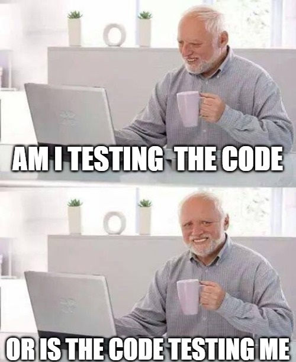

Throughout this project, effort estimation became one of the most important parts of managing our workflow. At first, I assumed estimating effort would mostly just involve guessing how 
long coding tasks would take. However, over time, I realized that software development involves much more than simply writing code. Planning, debugging, researching solutions, 
communicating with teammates, testing features, and even learning unfamiliar technologies all contribute significant amounts of time to a project. The effort estimation process helped me 
better understand how software projects are actually managed and why accurate tracking matters in both academic and professional environments.

For our GitHub project board, we added custom fields such as Estimated Effort, Coding Effort, Non-Coding Effort, and Estimator. These fields helped organize our work and allowed us to 
compare our original expectations with the actual time spent completing tasks. When creating estimates, I usually base my numbers on previous assignments, past experience with similar 
coding tasks, and how complicated I expect the feature to be. For example, if I had previously spent around two hours building a simple UI page, I would use that as a reference point 
when estimating another interface-related issue. I also considered whether a task required learning something completely new, such as integrating database features, debugging deployment 
problems, or working with unfamiliar frameworks. In those cases, I intentionally increased my estimates because research and troubleshooting usually took longer than expected.

Even though many of my estimates ended up being inaccurate, estimating in advance still provided important benefits. One major advantage was that it forced me to think about the scope of 
a task before starting it. Sometimes an issue initially sounded small, but after estimating it, I realized it actually involved multiple steps, such as database changes, frontend updates, 
testing, and debugging. For example, tasks related to authentication or database integration often took much longer than expected because solving one problem usually revealed three new 
ones hiding underneath it. There were multiple moments where I confidently thought a task would take “maybe twenty minutes,” only for my facial expression to completely drop after an 
error message appeared that I had never seen before. Something as small as changing one database field could suddenly turn into hours of debugging, rereading documentation, testing fixes, 
and double-checking that I would not accidentally break the project before pushing to main. Those experiences made me realize how unpredictable software development can be and why effort 
estimation is necessary even when the estimates are not perfectly accurate.

Tracking actual effort was also extremely useful because it revealed patterns in my workflow and highlighted areas where my estimates were consistently inaccurate. In many situations, the 
actual coding time was not the largest portion of the work. Non-coding efforts such as brainstorming, researching documentation, debugging deployment errors, discussing solutions with 
teammates, and organizing project tasks often consume just as much time as writing the actual code. This changed how I viewed software development overall. Before this project, I 
underestimated how much time is spent staring silently at the screen, trying to figure out why code that “should work” absolutely refuses to work. Some of the longest parts of development 
were not even writing code, but carefully tracing bugs line by line while slowly losing confidence in every decision I made five minutes earlier.

For tracking my effort, I primarily used GitHub project updates, timestamps from work sessions, and personal observations while working inside VS Code. I separated coding effort from non-
coding effort whenever possible. Coding effort included time spent actively writing code, debugging implementations, integrating features, and testing outputs. Non-coding effort included 
brainstorming, researching solutions online, discussing implementation ideas with teammates, planning UI designs, and organizing GitHub issues. I believe my tracking was reasonably 
accurate overall, although it was probably impossible to capture every minute perfectly. Sometimes, smaller interruptions or quick debugging sessions were difficult to account for exactly. 
However, I made an effort to record realistic data instead of simply inventing numbers after completing tasks. I think this honesty was important because inaccurate data would reduce the 
usefulness of the entire estimation process.

One of the most significant aspects of this project was the use of AI tools during development. I used ChatGPT by OpenAI, primarily GPT-5-based conversational assistance, to help 
brainstorm ideas, debug code, explain errors, suggest improvements, and refine implementations. AI became especially useful when encountering unfamiliar technologies or complicated bugs 
because it could quickly provide explanations and possible solutions. Sometimes AI gave surprisingly useful solutions within seconds, which honestly felt magical during stressful 
debugging sessions late at night. Other times, it confidently suggested code that either did not work, used outdated syntax, or created entirely new problems. Those moments taught me very 
quickly that AI responses still need careful verification and cannot replace actually understanding the code yourself.

## Some representative prompts I used included:

“Why is my Prisma schema causing a migration error?”
“Help me debug this Next.js hydration mismatch.”
“How can I structure this React Bootstrap component more cleanly?”
“What could cause this Vercel deployment failure?”
“Can you help me brainstorm ways to improve the user experience of this page?”

In terms of effort breakdown, I spent time in several different categories while using AI:

Prompt engineering: approximately 5–15 minutes per issue, refining prompts and explaining project context.
Generation time: usually under a minute, waiting for outputs.
Verification and debugging: often 15–40 minutes of testing whether the generated solution actually worked.
Integration and refactoring: approximately 10–30 minutes modifying AI-generated code to fit the existing codebase and project requirements.

Very little AI-generated content was accepted completely “as-is.” Most responses required manual edits, debugging, renaming variables, restructuring components, or adapting the logic to 
work properly within our project. In some cases, AI suggestions introduced new bugs or used outdated syntax, which meant I still needed to understand the code myself rather than blindly 
copying solutions. Because of this, AI functioned more as a collaborative assistant than a replacement for actual programming knowledge.

I believe tracking AI usage is important because AI is becoming increasingly integrated into modern software development. Without separating AI-assisted effort from normal coding effort, 
it becomes difficult to understand how productivity is changing or how much time is truly spent verifying and adapting generated code. AI can speed up brainstorming and troubleshooting, 
but it does not eliminate the need for critical thinking, debugging, or software engineering skills. In fact, verifying AI-generated responses often became one of the most time-consuming 
parts of development.

If I were to improve my estimation and tracking process in the future, I would focus on more detailed tracking throughout the project instead of relying on memory later. I would likely 
use a dedicated timer or tracking tool more consistently so that smaller tasks and interruptions are recorded more accurately. I would also break larger issues into smaller subtasks 
before estimating them because broad tasks were much harder to predict accurately. Additionally, I would spend more time reviewing previously completed issues before creating estimates, 
since historical data has become one of the best indicators of future effort.

Overall, this experience taught me that effort estimation is less about predicting the future perfectly and more about developing awareness of how software development actually works. 
Behind every “small fix” is usually a chain reaction of testing, debugging, researching, and decision-making that is invisible from the outside. Even though my estimates were frequently 
wrong, the process helped me become more realistic, more organized, and much more careful about managing both my time and my code. Tracking both coding and non-coding effort gave me a 
much more realistic understanding of software development, while tracking AI usage demonstrated how modern development workflows are evolving alongside new technologies.
