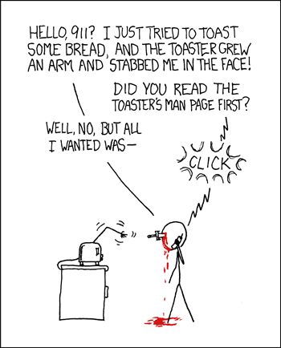

When people first hear the phrase design patterns, it can sound more intimidating than it really is. The word “design” makes it feel formal, and the word “pattern” can make it sound 
like something rigid or mechanical. But patterns are actually everywhere. They show up in quilting, weaving, architecture, music, and even in the ways people organize their daily routines. 
A pattern is not a finished object. It is a reusable way of arranging pieces so that the final result is stronger, clearer, and easier to build. In that sense, software design patterns 
are not very different from stitch patterns in fabric work: they do not create the sweater for you, but they give shape, consistency, and structure to something that might otherwise 
unravel.

That idea matters in programming because code is not just written to run once. It is written to be read, changed, debugged, and expanded. A beginner can often make a program “work,” but a 
stronger programmer starts thinking about how the code holds together. Does it tangle responsibility into one giant file, or does each part have a clear purpose? Is it easy to add a new 
feature, or does one small change break five other things? Design patterns help answer those questions. They are proven solutions to common software problems, not copied word-for-word, but 
adapted to fit the project. They give developers a shared vocabulary for structure. Instead of saying, “I made this one weird object that everything depends on,” a programmer might 
recognize that they are using a Singleton. Instead of manually rebuilding similar interface pieces over and over, they might use reusable components. The pattern is not the code itself. It 
is the logic behind the organization.

This is one reason design patterns feel so natural to me. They reflect a larger human instinct toward cohesion. Whether someone is sewing a repeating motif, organizing a lab procedure, 
or building a website, there is usually a difference between randomly assembling pieces and intentionally structuring them. Good structure reduces friction. In software engineering,
that reduction of friction matters because projects grow. What starts as a few files can become a whole system with pages, forms, database connections, user authentication, and shared 
interface elements. Without patterns, growth often creates a mess. With patterns, growth becomes more manageable.

That became especially clear in my final project. My project was not just a single script or a one-page site. It involved multiple parts working together: user-facing pages, shared visual 
components, forms, navigation, and data interactions. As the project developed, design patterns stopped feeling like an abstract interview topic and started feeling like the reason the 
codebase remained understandable. One of the most visible patterns in the project was component-based design. Instead of rewriting the same interface structure repeatedly, I used reusable 
components for recurring pieces such as navigation, page layout, and other UI sections. This pattern made the project more consistent visually, but more importantly, it made the code 
easier to maintain. If I wanted to update a shared part of the interface, I could do it in one place instead of hunting through every page.

Another pattern present in the project was a separation of concerns approach, which is closely related to architectural patterns such as Model-View-Controller thinking, even if the 
framework does not label it that way explicitly. The visual layer handled what the user sees. The logic layer handled actions such as processing forms or coordinating behavior. The data 
layer handled persistence and communication with the database. Keeping those responsibilities separate made the project much easier to reason about. A page component did not need to do 
everything. It could focus on presentation while other parts of the application handled data or business logic. That structure is one of the clearest examples of why design patterns 
matter: they reduce mental overload by giving each part of the program a job.

I also used a pattern similar to the Singleton in database access. In a modern web application, especially one using tools like Prisma, it is common to avoid creating unnecessary database 
client instances over and over. Instead, the application reuses a single managed instance. That is a practical example of a design pattern at work. The point is not to impress someone 
with terminology. The point is to solve a recurring engineering problem in a stable, predictable way. In this case, the pattern helps control access to an important shared resource and 
avoids wasteful or error-prone duplication.

There was also a kind of template pattern in how pages were structured. Different pages served different purposes, but many followed a familiar layout and flow: shared navigation, content 
area, forms or data display, and a consistent styling system. That repeated structure created a better user experience because the site felt coherent, but it also benefited development. 
Once a reliable structure existed, new pages could be built faster and with fewer mistakes. In that sense, a pattern becomes a bridge between design and implementation. It shapes how the 
application looks and how the code behaves.

What I find interesting is that design patterns do not make code less creative. They make meaningful creativity possible. Without structure, programmers waste energy reinventing solutions 
to the same problems. With patterns, they can focus on the unique parts of the project: what the application does, who it serves, and how it solves a real need. In my final project, the 
most important goal was not merely to assemble working files. It was to build something cohesive, readable, and expandable. The patterns in the project helped make that possible.
By the end of the project, design patterns no longer felt like a vocabulary list for interviews. They felt like a practical answer to a real question: how do you keep software 
from falling apart as it grows? The answer is that design patterns are reusable, experience-tested solutions for organizing code. In my final project, those patterns appeared through 
reusable components, separation of concerns, shared page structure, and controlled access to resources like the database. Much like stitch patterns in fabric, they did not 
create the whole piece on their own. But they gave the project its structure, rhythm, and durability. And that is what makes them so valuable, both in code and beyond it.

I used AI in a limited and supportive role during the writing process, mainly for brainstorming and revision, functioning less as an all-knowing software oracle and more as an unusually 
efficient essay reviewer with suspiciously strong grammar opinions 

