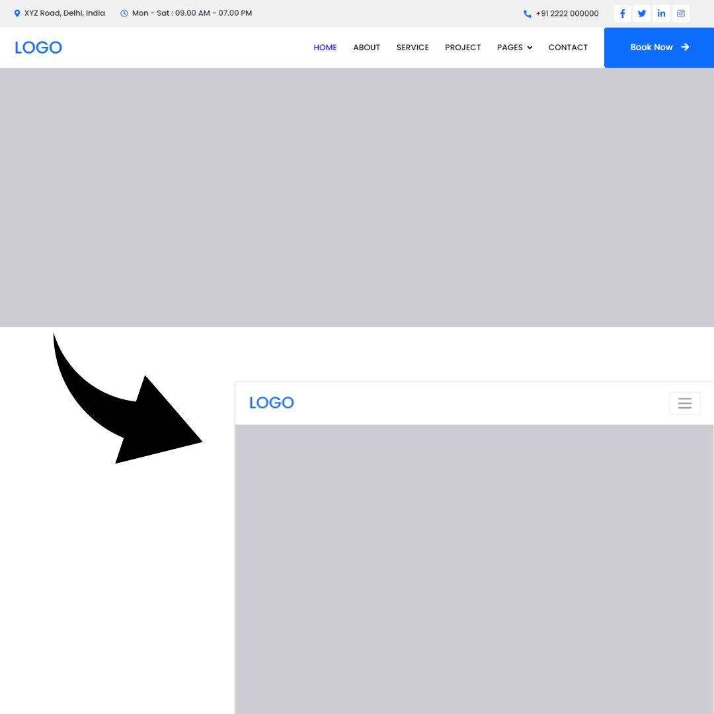

<div class="container my-5">
  <div class="row justify-content-center g-4">
    <div class="col-md-6 text-center">
      
    </div>
    <div class="col-md-6 text-center">
      
    </div>
  </div>
</div>

## Why UI Frameworks Are Worth the Climb
UI frameworks are not simple. The first time you open the documentation for Bootstrap, it becomes obvious that this is more than just “some CSS classes.” There are grids, breakpoints, 
and containers, 
rows, columns, utility helpers, and naming systems that feel like their own language. Learning Bootstrap can feel suspiciously similar to learning a new programming language. So the 
question makes 
sense. Why not just use raw HTML and CSS?
Because frameworks are not about avoiding work. They are about structuring it.
When I started recreating existing websites with Bootstrap 5, I thought it would be straightforward. Add a few classes, drop in some content, done. Instead, I spent hours testing layouts, 
adjusting 
columns, committing changes, pushing updates, and refreshing my browser to see what I broke this time. Something would look perfect on a desktop and fall apart on mobile. It was 
frustrating.
It was also strangely fun.
Recreating a site forces you to see the invisible architecture beneath a webpage. You start to notice how spacing creates rhythm, how grids divide space, how breakpoints control behavior 
across 
screen sizes. Instead of guessing, you begin to understand the system. That shift from confusion to clarity is incredibly satisfying.
Here is the kind of clean, responsive structure a framework makes easier to achieve.
These layouts are not impressive because they are flashy. They are impressive because they are consistent. Components align. Spacing feels intentional. The site adapts across devices 
without a maze 
of custom media queries. That consistency is hard to maintain repeatedly with raw CSS unless you build your own design system from scratch.
Raw HTML and CSS are essential. They teach you how layout actually works. Without that foundation, a framework becomes a crutch. But once you understand the fundamentals, a UI framework 
becomes a 
powerful tool. Instead of rewriting the same button styles and responsive rules for every project, you rely on a shared, tested structure. You can focus more on functionality and less on 
fighting 
margins.
From a software engineering perspective, frameworks offer real benefits. They improve maintainability because everyone works within the same system. They support scalability because 
patterns are 
reusable. They reduce decision fatigue because you don't have to reinvent design rules every time you start a new feature. In larger projects, that structure saves time and prevents chaos.
There is, however, a slightly heartbreaking realization. AI tools can now generate similar layouts in seconds. After spending hours testing and debugging, it can feel discouraging to see 
something 
comparable produced instantly. But AI can generate code. It cannot replace understanding. When something breaks, and it will, you need to know why. Framework literacy gives you that 
confidence.
I used AI to help refine this essay. Not to replace my thinking, but to shape it more clearly. In the same way, I see Bootstrap as a tool that reduces friction rather than replacing 
effort. The work 
is still there. The creativity is still there. The learning is definitely still there.
UI frameworks are frustrating to learn. They require testing, committing, pushing, and trying again. But they transform scattered CSS into organized systems. They make building feel 
intentional 
instead of chaotic. And even in a world of generative tools, there is something deeply worthwhile about knowing how it all works underneath the surface.
That understanding is what makes the climb worth it.

## EXAMPLES:
With raw HTML and CSS, you might write:

```html
<div class="container">
  <div class="left">Content</div>
  <div class="right">More Content</div>
</div>
```


```css
.container {
  display: flex;
}

.left, .right {
  width: 50%;
}
```
This works, but it only looks right at the screen size you designed it for. If someone opens the site on a phone or tablet, you have to write extra rules to adjust the layout. If you want 
spacing to stay consistent across the entire site, you have to define that yourself. Every adjustment is managed manually. (MEANING…Even though you design and build a website on a laptop 
or desktop computer, other people will view it on phones, tablets, and screens of all different sizes. A layout that looks perfect on your screen can easily look broken or cramped on a 
smaller device.)

With Bootstrap, the same structure looks like this:
```html
<div class="container">
 <div class="row">
   <div class="col-md-6">Content</div>
   <div class="col-md-6">More Content</div>
 </div>
</div>
```

In just a few classes, responsiveness is built in. On medium screens and above, the columns sit side by side. On smaller screens, they stack automatically. The framework encodes those 
layout rules for you.
The difference is not that Bootstrap removes complexity. The difference is that it organizes complexity into a system you can reuse.
The same pattern appears with components. Consider a basic button.
With raw CSS:

```html
<button class="custom-btn">Click Me</button>
```


```css
.custom-btn {
 background-color: blue;
 color: white;
 padding: 12px 20px;
 border-radius: 8px;
}
```

With Bootstrap:

```html
<button class="btn btn-primary">Click Me</button>
```

The Bootstrap version reduces repetition and ensures consistency across the entire project. Instead of redefining colors, padding, and border radius each time, you rely on a shared design 
language. Nice! Right?

