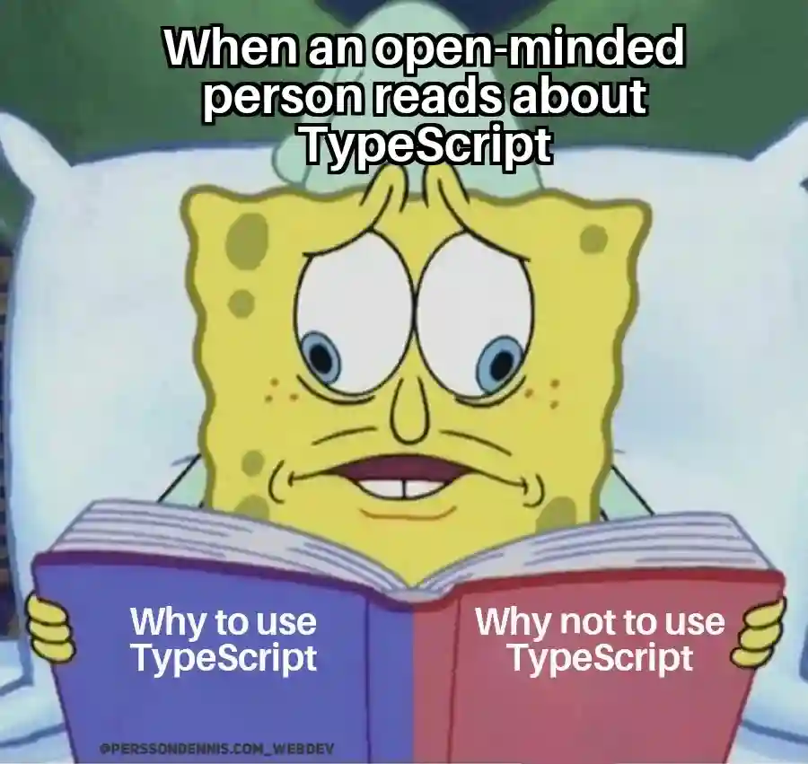

Learning a new programming language often feels less like starting from zero and more like learning a new accent. The ideas are familiar, but the rules, syntax, and expectations shift just enough to slow you down. My experience with TypeScript has been exactly that: familiar, occasionally frustrating, but also informative in ways I did not fully expect.

## Coming to TypeScript with Experience

Before this module, I already had experience with JavaScript, Java, C, and C++. I was also exposed to TypeScript during a summer game development internship. However, that experience came with a major caveat: much of the code was supported by built-in AI tools and a strong UI framework. Instead of writing everything from scratch, my work often involved scanning existing code, recognizing patterns, and making sure new code fit cleanly into the project’s structure.

That environment made development feel fast and visual. Hotkeys, UI components, and pre-built systems handled much of the heavy lifting. As a result, TypeScript felt less like a language I was mastering and more like a system I was navigating.

This course changed that. Without heavy AI assistance or a polished game engine interface, I had to engage directly with the language and understand why TypeScript behaves the way it does.

## What TypeScript Adds (and Takes Away)

TypeScript’s main selling point is its type system. By enforcing types, it can catch errors earlier and make large codebases easier to manage. From a software engineering perspective, this is a clear advantage, especially for teams working on long-term projects.

That said, coming from JavaScript and Java, TypeScript often feels like it adds extra steps. Declaring types, defining interfaces, and handling strict compiler rules can slow down development, especially for smaller projects. In comparison, JavaScript feels more flexible, while Java already has a well-established type system that feels more consistent and less optional.

For me, TypeScript sits in an uncomfortable middle ground. It tries to bring structure to JavaScript, but that structure sometimes feels layered on rather than natural. I would not call it abad language, but I am still unsure whether the tradeoff between safety and speed is worth it for all use cases.

## Athletic Software Engineering and WODs

The practice WODs (Workouts of the Day) introduce a very different learning style. Instead of slow, guided exploration, they emphasize speed, repetition, and problem-solving under pressure. At first, this approach was overwhelming. The time pressure made it easy to focus more on finishing than on fully understanding.

However, there is value in this style. The repetition builds familiarity, and the discomfort highlights gaps in understanding quickly. While stressful, the WODs feel similar to real-world situations where developers must think clearly with limited time.

I do not find this style immediately enjoyable, but I can see myself adapting to it. Over time, the stress may decrease as the patterns become more familiar and confidence grows.

## Is This a Language (and Method) That Works?

TypeScript has helped me think more carefully about structure and correctness, even when I disagree with how strict it can feel. While it is not my favorite language, it has value in team-based and large-scale software engineering contexts.

Similarly, athletic software engineering pushes me outside my comfort zone. It is not easy, but it may be effective. Whether it ultimately works for me depends on consistency and practice, but there is long-term benefit in learning how to perform under pressure.

## AI: A Scientific Calculator, Not a Replacement Brain

AI is a tool similar to a scientific calculator. It can speed things up and help check work, but it should not replace the ability to think and solve problems independently. Just as a calculator is only useful if you understand the math behind it, AI is most effective when the user understands the concepts it is working with.
AI is not always correct, and it can be confidently wrong. Approaching its output with healthy skepticism encourages verification, which often strengthens understanding rather than weakening it. In many cases, confirming or correcting an AI-generated answer helps reinforce knowledge and build confidence in the subject.
Used this way, AI becomes a support system rather than a shortcut. It works best when it assists learning instead of replacing the thinking that makes learning meaningful. With that noted, AI is useful, just not smart enough to replace common sense.

## AI Use Disclosure

AI tools were used as a grammar assistant, not a ghostwriter: helping fix spelling, improve clarity, and polish phrasing when needed. All ideas and opinions remain my own.
