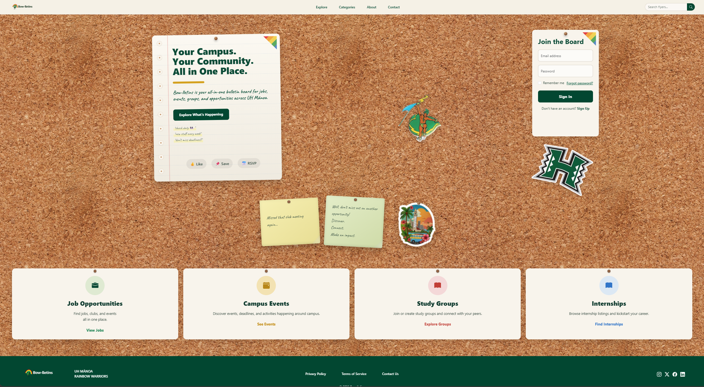

When people imagine software engineering, they often picture someone sitting alone in a dark room typing code for hours while staring at a monitor full of confusing symbols. Before ICS 314, I honestly thought software development worked somewhat like that, too. I assumed the hardest part would simply be learning programming languages or figuring out how to make websites function correctly. However, by the end of the semester, I realized the most meaningful part of software engineering was not actually the code itself. It was the people behind it.

Our final project, Bow-lletins, became the moment where everything we learned throughout ICS 314 finally connected together. Instead of isolated assignments or practice exercises, we suddenly had to combine all the skills we developed over the semester into one actual application built as a team. Bootstrap, React, Next.js, GitHub collaboration, Vercel deployment, issue driven project management, debugging, user interface design, and configuration management all stopped feeling like separate classroom topics and started feeling like pieces of one larger process. The final project felt less like homework and more like stepping into a real software development environment for the first time.

Bow-lletins was designed as a digital bulletin board platform for UH Mānoa students. The idea came from a real problem many students experience on campus: opportunities exist everywhere, but information is scattered across physical bulletin boards, Instagram stories, Discord servers, flyers taped to walls, club pages, and email newsletters. Because of that, students often miss internships, events, scholarships, or campus activities simply because they never saw the information in time. Our team wanted to create one centralized place where students could discover and interact with campus opportunities more easily.

What made the project especially meaningful to me was not just the application itself, but the experience of building it alongside other people. Teamwork in software engineering feels very different from teamwork in most classes. In many group projects, work can simply be divided into separate parts that barely interact. Software engineering is different because everyone’s work constantly affects everyone else’s work. One person changing a database schema can accidentally break another person’s frontend. A merge conflict can suddenly appear out of nowhere and transform an otherwise peaceful afternoon into a shared moment of confusion and panic. There is a very unique type of silence that happens when multiple people stare at the same error message while nobody fully understands what caused it yet.

At the same time, there is something strangely rewarding about solving those problems together. Some of my favorite moments from the semester were not when everything worked perfectly, but when our team slowly figured things out together after being stuck. There is a certain excitement when someone finally says, “Wait, I think I found the issue,” and suddenly the entire group comes back to life. Software engineering taught me that progress is rarely smooth. It usually involves trial and error, debugging, communication, adaptation, and patience.

Working on Bow-lletins also changed how I think about collaboration itself. In coding environments, teamwork is not just about splitting labor evenly. It is about trust. You trust other people’s code not to destroy the project. You trust teammates to communicate changes clearly. You trust people to push updates responsibly, document their work, and ask questions when needed. Over time, I realized software engineering depends just as much on communication and organization as technical skill.

The project also made the classroom concepts feel much more real. Bootstrap was no longer just a framework used for small exercises because we were actively designing layouts and trying to make the site visually appealing for real users. GitHub stopped feeling like a backup folder and became essential for coordinating branches, resolving merge conflicts, and tracking issues. Vercel deployment became exciting because seeing the project live online made it feel like something tangible instead of another assignment trapped inside VS Code.

One thing I found especially beautiful about software engineering was seeing how different strengths came together within the group. Some people were stronger at frontend design, others were better at organization, debugging, or backend logic. Nobody knew everything, and honestly, that made the project feel more human. There were moments where one person understood something immediately while another person was completely lost, only for those roles to reverse later during a different problem. The project taught me that software engineering is rarely about one genius programmer doing everything alone. It is usually a collective process where people contribute different skills toward building something larger together.

Bow-lletins also reminded me that software projects become more meaningful when they solve problems people genuinely experience. Since all of us were UH Mānoa students ourselves, the idea felt personal. We understood what it felt like to miss opportunities because information was scattered or difficult to find. Building something connected to our own campus community made the project feel more purposeful than simply creating a random application for a grade.

Looking back, the final project felt like the main stage of ICS 314 because it brought together nearly every concept we learned throughout the semester into one experience. More importantly, it revealed the human side of software engineering. Behind every application are conversations, disagreements, debugging sessions, shared frustration, creative ideas, teamwork, and moments where people slowly build something meaningful together. By the end of the course, I realized software engineering is not just about creating working software. It is about learning how to collaborate, adapt, communicate, and solve problems alongside other people.

Even now, when I think about Bow-lletins, I do not just remember the code. I remember the teamwork behind it. I remember the moments where we were all trying to figure things out together, the relief when deployment finally worked, and the strange mix of stress and excitement that came with building something real. That experience made software engineering feel much more alive than I expected when I first entered the course.

# Visit the site at: https://bowlletins.github.io

# Live Deployment (Vercel): https://bowlletins.vercel.app

# Source Code (GitHub): https://github.com/Bowlletins/bowlletins

(project picture for bowlletins, was AI-Generated by ChatGPT)
