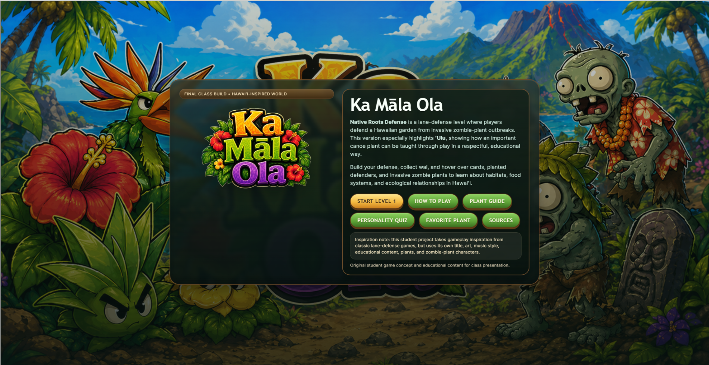
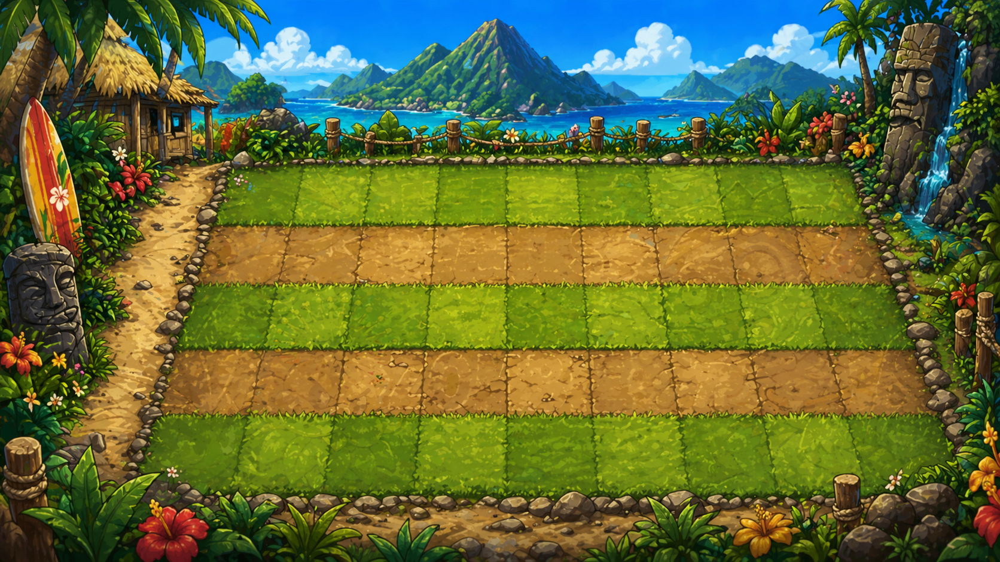
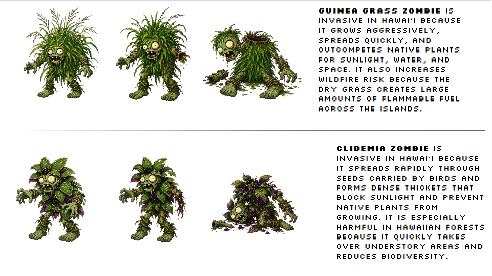
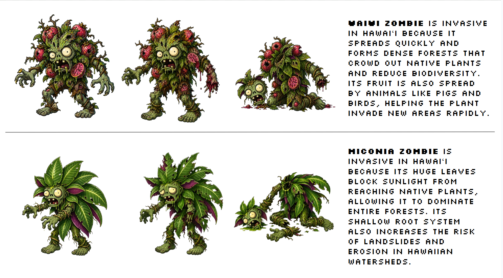
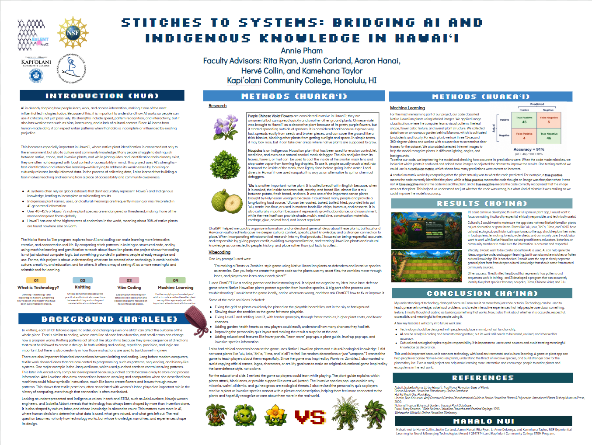

  

## To Learn by Doing
The Hawaiian phrase ma ka hana ka ʻike means “to learn by doing,” a proverb that captures the idea that real understanding comes not just from hearing or reading, but from experience 
itself. That idea shaped my experience in the Ma Ka Hana Ka ʻIke program, where learning was never limited to memorizing technical terms or watching someone else explain code. Instead, 
we explored technology by creating with it, questioning it, and seeing how it connects to the world around us. In that sense, the program was not just about artificial intelligence or 
programming. It was about discovering what happens when learning becomes active, creative, and grounded in real life.

Artificial intelligence is already influencing how people learn, work, and access information, making it one of the most powerful technologies in everyday life. It can recognize patterns 
quickly, respond interactively, and process large amounts of information in ways that are impressive and useful. At the same time, AI has serious limitations. It can be inaccurate, 
biased, and disconnected from cultural context. Because AI is trained on human-made data and shaped by human decisions, it can repeat the same unfair patterns found in the world it 
learns from. When the data is incomplete, unbalanced, or influenced by existing prejudice, the technology reflects those problems to us. This makes it important not only to ask what AI 
can do, but also what it should do, who it serves, and whose knowledge it includes.

That question becomes especially meaningful in Hawaiʻi. Here, native plant identification is not simply about memorizing species names or sorting plants into scientific categories. 
It is also connected to place, culture, stewardship, and community knowledge. Many people still struggle to distinguish between native, canoe, and invasive plants, even though this 
knowledge can shape how people understand and care for the environment around them. Plant guides and identification tools already exist, but many are not built with local accessibility
or cultural context in mind. Through collecting data for this app, I realized that I was learning alongside the project itself. I was not just helping build a tool for others; I
was also becoming more aware of how much there is to learn and how important it is that educational tools feel accessible, grounded, and relevant to the communities they are meant to 
serve.

What made the Ma Ka Hana Ka ʻIke program especially memorable was that it did not treat coding as something abstract or distant. Instead, it showed that programming can be understood 
through patterns people already know. One of the most unexpected and meaningful comparisons we explored was the relationship between knitting and coding. At first, those two things 
might seem unrelated. One belongs to yarn and needles, the other to screens and syntax. But the more I learned, the more the connection made sense. In knitting, each stitch follows a 
certain order, and changing even one stitch can affect the outcome of the whole piece. Coding works in much the same way. Each line serves a purpose, and even a small error can alter 
how the entire program behaves. In both practices, repetition, structure, and precision matter, yet both also leave room for creativity. A pattern is not the opposite of imagination; 
It is often what makes imagination possible.

The connection between textiles and computing is not just metaphorical. Long before modern computers existed, textile work already demonstrated ideas that are now central to 
programming: sequencing, pattern logic, and symbolic instruction. One well-known example is the Jacquard loom, which used punched cards to control woven designs. Those cards later 
influenced the development of early computers by showing how information could be stored and processed through patterned instructions. Ada Lovelace also recognized this connection 
when she described how machines could follow symbolic operations, much like looms produce flowers and leaves through woven patterns. These links reveal that the history of computing 
did not emerge from mathematics and engineering alone. It was also shaped by forms of labor and knowledge that are often overlooked, especially work historically associated with women.
This broader perspective also matters when thinking about underrepresented and Indigenous voices in technology. Figures such as Ada Lovelace, Navajo women engineers, and Isabella Abbott 
remind us that innovation is never only about invention. It is also about labor, culture, perspective, and whose knowledge is treated as valuable. That matters even more in AI, where 
human choices determine what data is included, what patterns are prioritized, and what kinds of knowledge are ignored. Technology is often presented as neutral, but it reflects the 
values and assumptions of the people who design it. Because of that, the deeper question is not only how technology works, but whose experiences shape its design and whose communities it 
is built to support.

This is one of the ideas that stayed with me most throughout the program. We learned not only that knitting can help explain programming, but also that AI itself depends heavily on 
patterns and the way humans guide it. Even something like “vibe coding,” where AI can become part of a creative or casual coding process, shows that prompts matter. The way a person
asks a question, structures an idea, or explains what they want can dramatically change the result. In that way, working with AI is not passive. It still requires judgment, clarity, 
and intention. We also learned more about what happens behind the scenes in machine learning, especially with models like convolutional neural networks, and how much effort goes into 
slowly improving a program’s accuracy. AI may seem instant on the surface, but underneath, it depends on careful testing, training, revision, and data quality. A single misleading 
example in a dataset can create results that feel almost like a bug, even when the system is technically doing what it was trained to do.

That realization made the program feel even more aligned with the meaning of ma ka hana ka ʻike. Real learning happened through making mistakes, adjusting ideas, and understanding 
that technology is never separate from the people building it. The app we worked on, which focused on machine learning and gamification to teach Hawaiian plant knowledge, reflected 
that principle. It was meant not only to teach users, but also to be shaped by what learners need. For me, building something educational also meant recognizing that the tool itself 
should come from a place of accessibility. A program meant to help people learn should not make learning feel distant, overly technical, or disconnected from the communities it is 
trying to reach.

In the end, the Ma Ka Hana Ka ʻIke program showed me that coding is not just about commands on a screen. It is about patterns, relationships, and ways of thinking that already exist in 
everyday life. Whether through knitting, plant knowledge, or machine learning, I came to see that technology becomes more meaningful when it is connected to culture, creativity, and 
community. AI can be powerful, but it is most valuable when used thoughtfully and with awareness of its limitations. What I learned from this program was not just how technology works, 
but how much it matters who builds it, how it is taught, and what kinds of knowledge it is allowed to carry. In that way, ma ka hana ka ʻike became more than a phrase. It became the 
method through which I learned to see technology differently: not as something separate from people, but as something shaped by our choices, our values, and our willingness to learn by 
doing.

## Results from the ma ka hana ka ʻike program!

Vibecoding (native plants vs. invasive species game - plants vs. zombies):

Ka Māla Ola was inspired by lane-defense style games like Plants vs. Zombies, but I wanted to transform the idea into something connected to Hawaiʻi’s environment, culture, and education. 
Instead of using random fantasy plants, I chose Native Hawaiian plants such as ʻulu, kalo, ʻōhiʻa, ʻilima, and ʻaʻaliʻi because many of them have deep cultural importance as canoe plants, 
food sources, medicines, or symbols tied to Hawaiian identity. The “zombies” in the game are invasive species like miconia, guinea grass, waiwī, and clidemia because these plants are real 
ecological threats in Hawaiʻi. I wanted players to understand that invasive species are not just abstract environmental terms, but actual organisms that damage forests, increase wildfire 
risk, outcompete native species, and affect local ecosystems. By turning them into enemies in the game, the environmental issue becomes easier to visualize and understand.

I also wanted the game to feel more personal and memorable, so I added educational hover panels, a plant guide, and a personality quiz. The personality quiz was designed so 
players could emotionally connect with the plants instead of seeing them as just “weapons” or game assets. At the end of the quiz, players receive a Native Hawaiian plant or invasive 
species mascot along with a description of its personality traits and cultural or ecological role. My goal was to make people more likely to recognize or care about these plants in the 
real world after playing. I wanted the game to balance fun gameplay with cultural respect and environmental awareness instead of being purely entertainment.

The coding process involved a lot of planning, experimentation, and troubleshooting. I built the game in Python/HTML-style web code and tested it locally through Git Bash using a Python 
server so it could run in a browser as a fully playable game. One of the most difficult parts was designing the board system so plants aligned correctly with the visual grid. Since the 
background image was custom-made and not perfectly symmetrical, I had to manually adjust coordinates, spacing, hitboxes, and placement logic multiple times until the plants snapped 
properly into the playable squares. I also had to redesign portions of the interface to make the game feel more like a polished mobile app instead of a rough prototype.

The game includes multiple gameplay systems and features. Players collect wai resources and place Native Hawaiian plants onto the board to defend the garden from incoming invasive 
species. Different plants serve different roles, including attackers, defenders, and support plants that generate more wai. The zombies visually change as they lose health, using separate 
damaged and defeated sprites. Once a zombie reaches half health, it swaps to a damaged version, and when its health reaches zero, it collapses, fades away, and disappears. The game also 
includes hover information panels, filters for plant categories, level-up popups, restart options, animated enemy movement, and a victory screen thanking players for saving the KCC garden.

I also created a progression and level system to make the game more engaging over time. Players begin with a smaller set of unlocked plants, then gain access to more defenders as they 
progress through Levels 1–3. Each level increases the difficulty by making invasive species move faster, increasing plant costs, and reducing the number of chances players have if enemies 
break through the defenses. A health-heart system helps visually communicate how many chances remain before game over. At the end of Level 3, the player reaches a final victory screen 
featuring a KCC-inspired logo and a message thanking them for protecting the garden. Overall, the project became both a playable strategy game and an interactive educational experience 
focused on Hawaiian ecology and invasive species awareness.

