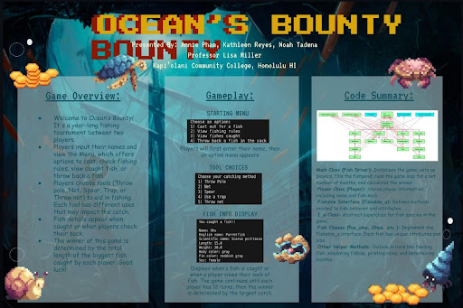
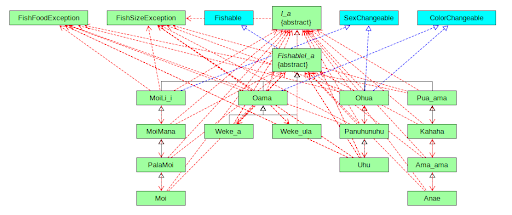

Ocean’s Bounty is a two-player, turn-based fishing game simulation designed to model strategy, probability, and resource management 
over a fixed game cycle. The game represents a year-long fishing tournament in which players take turns selecting tools, catching 
fish, viewing rules, managing their catch sack, and making decisions that influence their final score. Each fish species is modeled 
with unique attributes such as size, weight, color, and behavior, and the winner is determined by the total length of the largest fish 
caught. The project combines structured data modeling with gameplay mechanics to create an engaging competitive experience while 
reinforcing concepts such as abstraction, iteration, and rule-based systems.

This was a collaborative group programming project, and my primary role focused on code integration, logic refinement, and system-
level design, alongside visual communication and documentation. While all team members contributed to the codebase, I regularly 
reviewed and revised code across multiple fish classes to ensure consistency in behavior, attributes, and gameplay balance. I checked 
individual fish files, verified that they correctly implemented shared interfaces and inheritance structures, and adjusted logic so 
that fish outcomes aligned with player tool choices and game rules. This included designing and refining different consequences based 
on player decisions, such as tool selection, catch results, and turn-based actions.

In addition to revising code, I served as the editor and system-level reviewer for the project. I frequently tested gameplay flow, 
identified logical edge cases, and suggested changes to improve clarity, fairness, and extensibility. Rather than focusing on a single 
isolated feature, my contributions emphasized how individual components: players, fish classes, tools, and menus; fit together within 
the overall architecture of the game. This required understanding the full program structure, coordinating with teammates about 
changes, and ensuring that updates in one part of the code did not unintentionally affect other areas of the system.

I was also responsible for visual communication and presentation, including designing and assembling the final project poster. This 
involved translating technical concepts such as class relationships, interfaces, and game flow into a clear, accessible format for 
presentation. Through this project, I strengthened my understanding of object-oriented design principles (inheritance, interfaces, 
abstraction, and modularity), extensible system design, and collaborative development. Ocean’s Bounty helped solidify my ability to 
balance technical correctness with usability and communication, and reinforced how thoughtful architecture and iteration can make 
complex systems easier to understand, extend, and maintain.

This diagram visualizes the object-oriented architecture of Ocean’s Bounty and illustrates how individual fish species are 
modeled through inheritance, interfaces, and shared behaviors. At the top level, abstract classes and interfaces define 
common properties and actions—such as whether a fish can be caught, how its size is validated, how it reacts to player tools, 
or whether it can change attributes like color or sex. These abstractions enforce consistent behavior across the system while 
allowing individual fish species to retain unique characteristics.

Each green box at the lower levels represents a specific fish species native to Hawaiʻi, such as Moi, ʻUhu, ʻAmaʻama, Weke, 
Puaʻama, and ʻOama. These species inherit shared functionality from abstract parent classes (such as Fishable_a) while also 
implementing interfaces that define specialized behavior. This design allowed each fish to behave differently in response to 
player choices, such as which fishing tool was used, without duplicating code. By structuring the system this way, new native 
species could be added easily by extending existing abstractions rather than rewriting core logic.
The diagram also highlights how exception handling and validation (such as food and size constraints) are integrated into the 
system, ensuring realistic and rule-based interactions. Overall, this structure reflects a deliberate attempt to combine 
culturally relevant content with sound software engineering practices. By modeling real native Hawaiian fish species within a 
modular, extensible architecture, the project connects gameplay mechanics with local ecological knowledge while demonstrating 
effective use of inheritance, interfaces, and abstraction in object-oriented programming.
