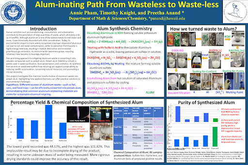

This project investigated the conversion of aluminum waste into potassium aluminum sulfate (alum) through a series of controlled 
chemical reactions, emphasizing sustainability, waste reduction, and applied chemistry. Using common aluminum sources such as foil, 
food trays, and beverage cans, the project demonstrated how discarded materials can be transformed into a useful chemical product 
through dissolution, precipitation, crystallization, and purification processes. The work highlighted real-world environmental 
challenges related to waste accumulation and resource conservation, framing chemistry as a practical tool for supporting circular 
economy principles.

My role in this project involved experimental execution, data analysis, and scientific communication. I participated in the synthesis 
process by dissolving aluminum in potassium hydroxide, precipitating aluminum hydroxide using sulfuric acid, and recrystallizing alum 
through controlled heating and cooling. I contributed to testing chemical composition and purity using flame tests, sulfate tests, 
aluminum identification reactions, and melting point analysis. In addition, I helped analyze percentage yield data across different 
aluminum sources and interpret anomalies such as yields exceeding 100%, identifying incomplete drying as a likely experimental 
limitation. I also played a key role in organizing results and presenting findings visually through the final research poster, 
ensuring that reaction pathways, experimental steps, and conclusions were communicated clearly and accurately.

Through this project, I strengthened my understanding of applied inorganic chemistry, experimental design, and data interpretation. I 
learned how small procedural details—such as drying conditions or filtration techniques—can significantly impact measured outcomes and 
experimental reliability. The project also reinforced the importance of clear scientific communication, as translating complex 
chemical processes into an accessible poster required careful structuring and concise explanation. Overall, this experience deepened 
my appreciation for sustainability-focused chemistry and demonstrated how laboratory techniques, data analysis, and visual 
presentation work together to support scientific inquiry and environmental problem-solving.
