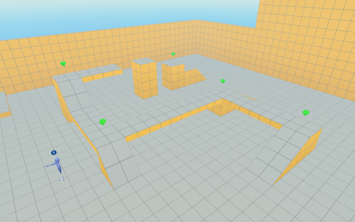
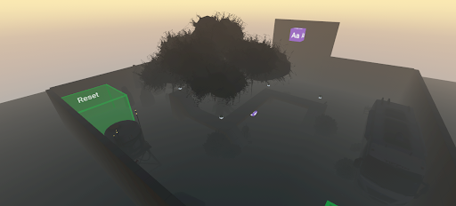

<div class="text-center p-4">
  
  
</div>

The above illustrates Before: Initial Game Implementation
The initial version of the game consisted of a basic obstacle course world with limited interactivity. Core mechanics included simple 
collision detection between the player and objects, a basic scoring system for collecting gems, and a game manager that controlled 
the 
main game states such as start, play, end, and reset. The game supported multiplayer interaction, where all players contributed 
toward 
a shared goal, and used dynamic text to display scores and basic updates. While functional, the game environment was minimal and 
focused primarily on mechanical correctness rather than atmosphere or immersion.
After: Expanded and Immersive Game Experience
In the updated version, the game evolved into a fully themed haunted obstacle course designed to create a cohesive and immersive 
player experience. I implemented Gizmos to animate and control game objects, added sound effects to enhance the atmosphere and 
provide 
feedback when gems were collected, and used skybox Gizmos to establish a nighttime setting. I imported custom asset libraries—
including flooring, walls, and decorative props—to enrich the environment and support the spooky theme. Interactive objects were 
added 
throughout the world to encourage exploration and engagement, reinforcing the idea that small design details significantly impact 
immersion and player experience.

This project explored how immersive virtual reality (VR) environments can be used as effective educational tools by 
transforming traditional learning experiences into interactive, game-based systems. Working with XRIO and Kapiʻolani 
Community College, I designed and built a series of VR worlds using Meta Horizon Worlds that incorporated puzzles, 
challenges, reward systems, and progression mechanics to support learning objectives. The project drew on research in game-
based learning and gamification, focusing on how elements such as feedback loops, scoring systems, collaboration, and 
adaptive challenges can increase student engagement and retention. The end result was a set of playable VR environments that 
demonstrated how educational content can be embedded into interactive gameplay rather than delivered through static textbooks 
or lectures.

My role in this project involved both technical development and design iteration. I was responsible for building custom 
worlds from scratch in Meta Horizon Worlds, writing and modifying TypeScript-based scripts to control gameplay logic, player 
interactions, scoring systems, object behavior, and event triggers. I developed multiple tutorial-based environments, 
beginning with foundational mechanics such as movement, collision detection, and object interaction, and progressing toward 
more complex features including rotating puzzle objects, dynamic UI feedback, cross-platform considerations, camera and HUD 
adaptations, and custom interaction scripts (such as color-changing and number-revealing mechanics). I also designed the 
layout, flow, and visual structure of each world, incorporating audio, lighting, and environmental props to enhance 
immersion. Throughout the project, I iteratively tested and refined each world based on player experience and usability.

Through this experience, I gained hands-on skills in VR development, scripting, and interactive system design, as well as a 
deeper understanding of how game mechanics can support learning outcomes. I learned how to break down complex systems into 
modular components, design logic-driven interactions, and debug behavior in a real-time 3D environment. Beyond technical 
skills, the project strengthened my ability to think critically about user experience, accessibility, and engagement in 
educational technology. It also reinforced the importance of iterative design, experimentation, and reflection when building 
interactive systems. Overall, this project helped me connect computer science concepts with real-world applications in 
education, and it shaped my interest in using immersive technology to create meaningful, learner-centered digital experiences.

Here is some code....

```cpp
import { Entity, AudioGizmo } from 'horizon/core';
import * as hz from 'horizon/core';

// This component changes the color of a model when a player enters a trigger
// and plays a corresponding sound for each color change
class ColorChanger extends hz.Component<typeof ColorChanger> {
  static propsDefinition = {
    model: { type: hz.PropTypes.Entity },   // The model entity to change color
    trigger: { type: hz.PropTypes.Entity }, // The trigger entity to detect player entry
    sound_1: { type: hz.PropTypes.Entity },
    sound_2: { type: hz.PropTypes.Entity },
    sound_3: { type: hz.PropTypes.Entity },
    sound_4: { type: hz.PropTypes.Entity },
    sound_5: { type: hz.PropTypes.Entity },
    sound_6: { type: hz.PropTypes.Entity },
    sound_7: { type: hz.PropTypes.Entity }, // Array of sound entities
  };

  // Index to keep track of the current color
  private currentColorIndex = 0;
  private soundArray!: Entity[];

  // Array of natural-looking colors (pastel/soft tones)
  private colors = [
    new hz.Color(0.9, 0.6, 0.6),  // Soft Pink
    new hz.Color(0.6, 0.8, 0.6),  // Soft Green
    new hz.Color(0.6, 0.6, 0.9),  // Soft Blue
    new hz.Color(0.9, 0.9, 0.6),  // Soft Yellow
    new hz.Color(0.8, 0.6, 0.9),  // Lavender
    new hz.Color(0.6, 0.9, 0.9),  // Aqua
    new hz.Color(0.9, 0.75, 0.6), // Peach
  ];

  // Array to store the sound gizmos
  private soundGizmos: hz.AudioGizmo[] = [];
}
```
